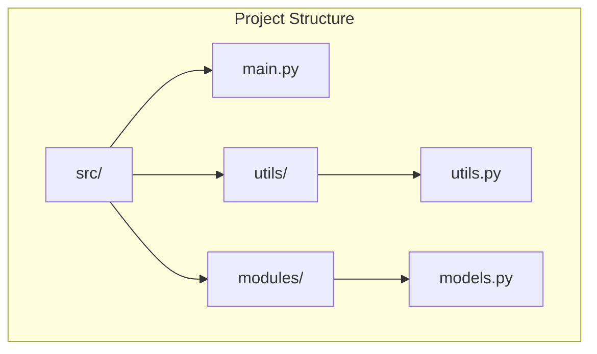

# C214-L1-dependency-injection

Repository dedicated to applying dependency injection in a Python code - lab activity for C214.

## Index
1. [Overview](#overview)
2. [How to Run Via Terminal](#how-to-run-via-terminal)
3. [Explanation of Injection](#explanation-of-injection)
4. [Project Structure](#project-structure)
5. [Author](#author)

## Overview

This project is a simple implementation of dependency injection using Python. The code is modularized and contains a machine learning model training pipeline. The RandomForest and LogisticRegression models are dynamically injected into the training pipeline, along with the injection of a data preprocessor (StandardScaler).

## How to Run Via Terminal

1. **Create and activate a virtual environment:**

- **Using commands via terminal**

    1. **Creating a virtual enviroment**
        ```bash
        python -m venv C214venv
        ```

    2. **Activate the virtual environment:**

        - On Windows:

        ```bash
        C214venv\Scripts\activate
        ```

        - On Linux/MacOS:

        ```bash
        source C214venv/bin/activate
        ```
    
- **Using a script**

    ```bash
    ./scripts/create_and_activate_venv.sh
    ```
    
3. **Install the project dependencies:**

    ```bash 
    pip install -r requirements.txt
    ```

4. **Run the main code:**

    ```bash 
    python src/main.py
    ```

## Explanation of Injection

Dependency injection is used to dynamically provide specific class instances (such as machine learning models) and auxiliary objects (such as scalers) to the training pipeline. Below are the locations where the injection occurs:

- **Machine Learning Models:** Dependency injection occurs in the `MLTrainingPipeline` class, where ``RandomForestModel`` and ``LogisticRegressionModel`` are passed as dependencies during initialization.

    ```python
    random_forest_pipeline = MLTrainingPipeline(RandomForestModel(), scaler)
    logistic_regression_pipeline = MLTrainingPipeline(LogisticRegressionModel(), scaler)
    ```

- **Data Scaler:** The preprocessor ``StandardScaler`` is also injected into the pipeline as an external dependency.

    ```python
    scaler = get_scaler()
    random_forest_pipeline = MLTrainingPipeline(RandomForestModel(), scaler)
    ```

## Project Structure



- ``src/``: Directory that contains the main code.
    - ``main.py``: The main file that contains the logic to run the project and inject dependencies.
- ``utils/``: Directory that contains utility code for loading data, splitting datasets, scaling, and evaluating models.
    - ``utils.py``: Helper functions such as data loading and model evaluation.
- ``modules/``: Directory that contains the implementation of machine learning models and the pipeline.
    - ``models.py``: Defines the ``BaseModel`` interface, ``RandomForestModel`` and ``LogisticRegressionModel`` classes, and the ``MLTrainingPipeline``.

## Author

### [Matheus Fonseca](https://github.com/matheusAFONSECA)

Undergraduate student in the eighth (8th) semester of Computer Engineering at the National Institute of Telecommunications (Inatel). I participated in a Scientific Initiation at the Cybersecurity and Internet of Things Laboratory (CS&ILAB), where, in the Park Here project, I developed skills in computer vision applied to parking systems, focusing on license plate recognition and vehicle identification. Additionally, I served as a teaching assistant for Physics 1, 2, and 3, helping with practical classes, report writing, and answering theoretical questions. Currently, I am an intern at the Inatel Competence Center (ICC) in the PDI SW department.

